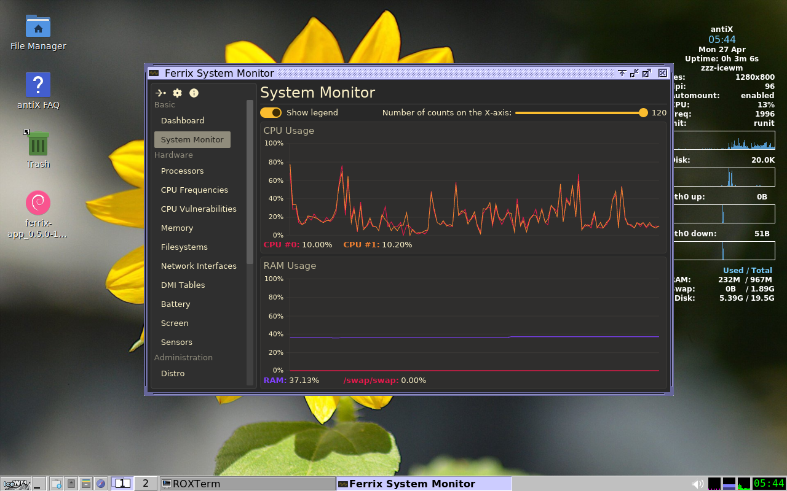
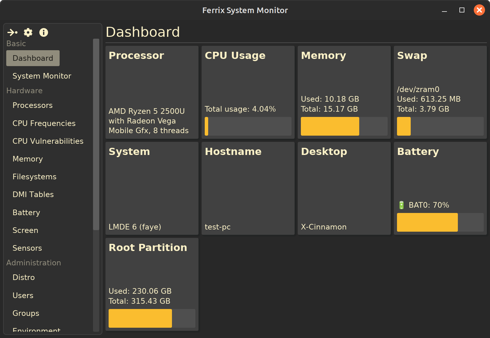
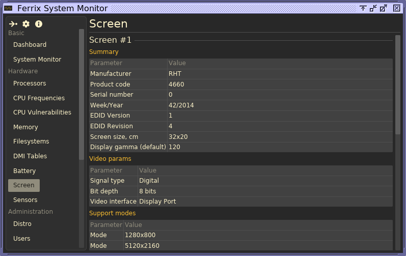
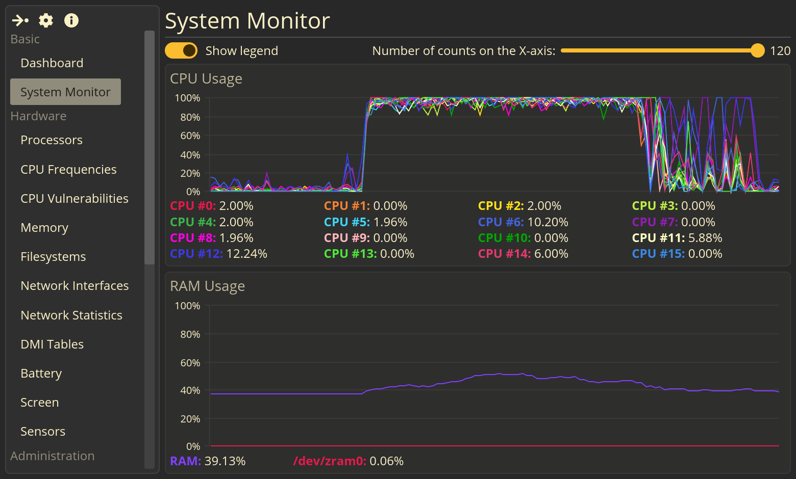
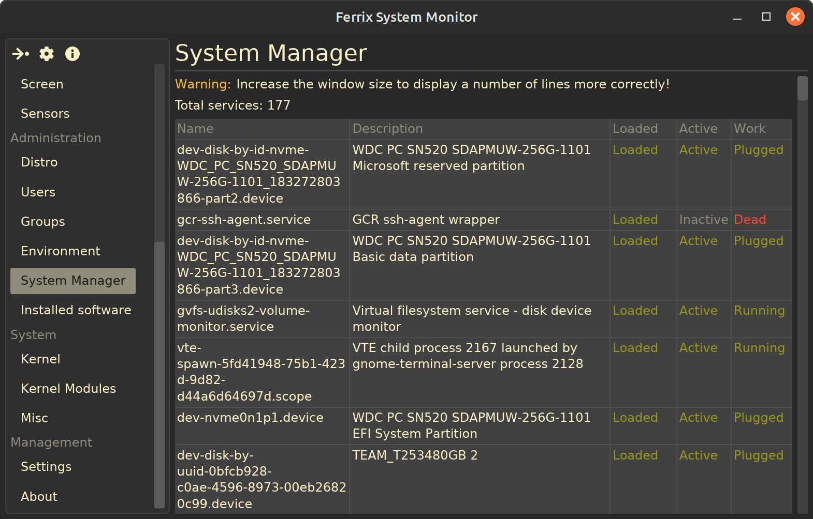

  <h1>FSM - Ferrix System Monitor</h1>
  <h3>Ещё один системный профайлер для Linux</h3>

        

  
<b>
    <a href="https://github.com/mskrasnov/FSM/releases/latest">Скачать последнюю версию</a> |
    <a href="https://github.com/mskrasnov/FSM">GitHub проекта</a> с более подробными сведениями |
    <a href="./gallery.html">Скриншоты</a> |
    <a href="./docs/index.html">Пользовательская документация</a> | 
    <a href="https://boosty.to/mskrasnov">Boosty</a>
  </b>

---

FSM - простой системный профайлер для современных дистрибутивов Linux. Это программа, которая отображает сведения о программном и аппаратном обеспечении компьютера. Она предназначена для современных дистрибутивов ОС Linux.

Совместима с Debian версии 11 и выше, Ubuntu версии 22.04 и выше, Fedora 42 и выше. Может работать и с другими дистрибутивами Linux, вышедшими не ранее 2022 года.

## Скачать

**[(другие типы пакетов здесь)](https://github.com/mskrasnov/FSM/releases/latest)**

На данный момент собираются следующие типы пакетов:

| Тип      | Архитектуры                | Сборочный хост |
|----------|----------------------------|----------------|
| AppImage | `amd64`                    | Debian 11      |
| deb      | `amd64`, `i686`, `aarch64` | Debian 11      |
| rpm      | `amd64`                    | Fedora 42      |

## Функции

### Краткие сведения о ПК в виде карточек

После запуска программы пользователя будет встречать обзорная страница с краткими сведениями о ПК и установленной на него ОС.

### Простой формат представления данных

В отличие от Hardinfo и аналогов, в Ferrix почти всё отображается в виде лент с таблицами. Для некоторых пунктов таблицы приведены всплывающие подсказки с описанием параметров - просто наведите мышь на нужный пункт таблицы.

### Поддержка современных технологий

В работе над Ferrix сделан упор на поддержку современных технологий. Пока что эта программа умеет отображать сведения о сервисах `systemd`. Интеграция с этим системным менеджером всё ещё далека от завершения - в скором времени я планирую добавить ещё ряд функций, связанных с `systemd`.

---

## Roadmap

> Ссылка на [репозиторий GitHub](https://github.com/mskrasnov/ferrix).

- [ ] Страница "Виртуальная Память" со статистикой виртуальной памяти
- [X] Страница "Накопители" с информацией о смонтированных файловых системах (устройство, точка монтирования, ФС, полный и занятый объём)
- [ ] Экспорт данных в `*.txt`, `*.json` и `*.xml`
- [ ] Консольная версия программы
- [ ] Возможность поиска и сортировки на страницах "Пользователи", "Группы", "Системный менеджер"
- [ ] Возможность работы с сервисами systemd

## Возможности

Получение сведений о ПО:

- [X] Название, версия, архитектура ОС, информация о её разработчиках;
- [X] Список присутствующих в системе пользователей и групп;
- [ ] Список в данный момент залогиненных в системе пользователей;
- [X] Список сервисов `systemd`;
- [X] Список установленного ПО;
- [ ] Текущие дата и время, часовой пояс;
- [X] Язык системы (для текущего пользователя);
- [X] Список переменных окружения (для текущего пользователя);
- [ ] Текущая сессия (консоль/Xorg/Wayland);
- [X] Используемое рабочее окружение;
- [X] Ядро Linux (версия ядра, версия компилятора);
- [X] Параметры загрузки ядра (cmdline);
- [ ] Список поддерживаемых ядром файловых систем;
- [X] Список загруженных модулей ядра;
- [X] Средняя загрузка системы;
- [X] Время работы системы, время простоя системы;
- [ ] Список драйверов консоли, список активных консолей;
- [X] Максимальное количество открытых файлов;
- [X] Максимальное количество PID;

Получение сведений об АО:

- Базовая информация:
  - [X] Процессор (количество ядер, количество потоков, частота на каждое ядро, поддерживаемые инструкции);
  - [X] Оперативная память, подкачка;
  - [X] Смонтированные файловые системы (общий объём, сколько занято, сколько свободно, файловая система, точка монтирования, опции монтирования);
  - [ ] Накопители (общий объём, список разделов, данные SMART);
  - [X] Аккумулятор(ы) ноутбука (если есть);
  - [ ] Видеокарта;
  - [ ] Сетевая карта;
  - [ ] Bluetooth;
  - [ ] Звуковой чип;
  - [X] Данные об экране ноутбука (eDP) или мониторе (HDMI), информация об установленных для него(них) частоте, разрешении и ориентации;
  - [ ] Подключенные к компьютеру внешние устройства;
  - [ ] ACPI;
  - [ ] Список разделов дисков;
- Чтение из таблиц DMI:
  - [X] BIOS/UEFI;
  - [X] Материнская плата компьютера;
  - [X] Шасси компьютера;
  - [X] Оперативная память;
  - может быть, что-то ещё в будущем;

## Системные требования

- **ОС:** пакеты собираются для Debian и Fedora, но в принципе заработает везде;
- **Системный менеджер:** `systemd`;
- **Объём ОЗУ (полный):** 512 МБайт для корректной работы программы;
- **Свободное место на диске:** 500 МБайт;
- **Рабочее окружение:** ограничений в рабочем окружении нет, FSM корректно заработает в любом;

## Стек технологий

- **ОС:** x84_64 Linux, glibc;
- **Язык программирования:** Rust;
- **Графический стек:** `iced`;
- **IPC:** D-Bus;

## Поддержать разработчика

FSM разрабатывается [студентом](/) в одиночку. Эта программа не является серьёзным профессиональным проектом и я не думаю, что найду силы довести её до конца, сделав полноценным аналогом если не AIDA64, то хотя бы Hardinfo.

Тем не менее, если вам нравится эта программа, то вы можете внести посильный вклад в её развитие и поддержку, перечислив любую сумму на электронный кошелёк или банковскую карту.

> - **Банковская карта: `2202 2062 5233 5406` (Сбербанк)**
> - **Boosty: <https://boosty.to/mskrasnov>**
